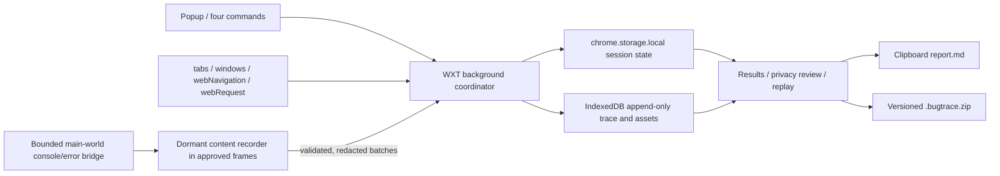

# Chrome 操作录制扩展与私有仓库初始化

Status: Complete
Created: 2026-08-17
Plan readiness: Approved
Approval: All P0-P7 approved by user on 2026-08-17

## Summary

把当前空目录初始化为面向多个 Chrome 扩展的私有 pnpm workspace，并先推送到 `JUNERDD/chrome-extension`；随后以 WXT、React、TypeScript 和 Manifest V3 开发第一个扩展 `extensions/bugtrace-recorder`。

首版 Bugtrace Recorder 提供录制、暂停、继续、停止四个操作及四个可由 Chrome 管理的快捷键。它把“完整录制”定义为一个可验证的安全边界：仅自动跟随开始录制的 tab 及其新开后代，在获准 HTTP(S) 页面内记录语义操作、导航、有限诊断、脱敏 rrweb DOM 证据和节制截图；所有不支持、丢失或截断的证据都必须进入 coverage/gap，不能伪装成“没有发生”。停止后复制可直接粘贴到 bug 工单的 Markdown，并下载带版本化 JSON Schema 的 `.bugtrace.zip`。

## Clarifying Questions

- [x] GitHub 目标 -> 使用当前已登录账号 `JUNERDD`，创建私有仓库 `JUNERDD/chrome-extension`；2026-08-17 的只读查询未发现同名仓库。
- [x] Git 策略 -> 默认分支 `main`，使用当前 HTTPS 凭据；先完成最小仓库基线并首次推送，再开发扩展并继续推送。
- [x] 录制边界 -> 自动纳入起始 tab 及其子 tab/弹窗；只覆盖获准 HTTP(S) 页面；默认全量输入脱敏；不启用 `chrome.debugger`；浏览器/系统 UI 与受限页面写成时间线 gap。
- [x] 证据层 -> 语义 trace 是 Agent 与 Markdown 的规范主数据；ZIP 同时包含严格脱敏、分段、限额的 rrweb DOM 事件与截图，并提供扩展内人工回放。
- [x] 诊断层 -> 采集 `window.error`、`unhandledrejection`、限额且脱敏的 `console warn/error`，以及安全 `webRequest` 元数据；不保存敏感 header 或请求/响应 body。
- [x] 分发边界 -> 首版只作为私有仓库中的 unpacked/internal 工具；Chrome Web Store 发布、云上传和工单系统直连均不在本次范围。

## Scope And Success Criteria

### MVP Includes

- 一个 Chrome profile 同时最多一个全局录制会话，状态为 `idle -> recording <-> paused -> finalizing -> completed`，另有 `interrupted` 恢复状态。
- popup、action badge、录制页内状态提示，以及 `record`、`pause`、`resume`、`stop` 四个 Chrome commands。
- 起始 tab、由其打开的新 tab/弹窗、同 tab 普通导航、SPA/history/hash 导航，以及 tab/window 创建、激活和关闭时间线。
- `click`、`dblclick`、`contextmenu`、合并后的 `fill/change`、`select/check`、`submit`、非文本快捷键、节流 scroll 和 drag/drop 结果；只接收 `isTrusted` 用户事件。
- 每个动作保存多候选 locator：测试属性、ARIA role/name、稳定 id/name/label、属性组合、结构 CSS；XPath 仅为最后候选，并附 frame/shadow 路径、目标摘要与 viewport rect。
- rrweb 分段录制：暂停时关闭当前 segment，继续时以新的 `Meta + FullSnapshot` 开段；不启用 canvas，不使用 rrweb 跨源 iframe 转发。
- 页面错误、安全 console、网络元数据、手动/错误/导航/停止截图；所有页面内容统一标记为 `untrusted_observation`。
- `chrome.storage.local` 中的小型权威状态、IndexedDB append-only 事件/资源日志、Service Worker 回收和浏览器重启后的可见恢复。
- 停止后的 results 页：填写或跳过 Title/Preconditions/Expected/Actual/Notes，检查隐私摘要和截图，复制 Markdown，下载 ZIP，并在扩展内加载 rrweb 证据回放。

### Definition Of Done

- popup 与四个 command 对状态机产生相同结果；Chrome 快捷键冲突会被识别，并引导用户去 `chrome://extensions/shortcuts` 重绑。
- 暂停期间不持久化采集事件；继续后语义时间线保持同一 session，rrweb 从新 segment 恢复。
- 页面刷新、SPA 跳转、新开后代 tab、Service Worker 被终止后均能继续或明确进入 `interrupted`，不静默丢失。
- 任意 stop 都先 flush，再在超时后带 gap 完成；至少保证 `report.md`、`trace.json`、schema 和 coverage 可导出。
- 导出 fixture 通过 JSON Schema 校验，Markdown 可直接粘贴，ZIP 中每个资源有 SHA-256；故意注入的密码、OTP、token、Cookie、Authorization、query 值和 body 哨兵不能出现在产物中。
- 本地与 GitHub 上的仓库均为 `main`，GitHub visibility 为 `PRIVATE`，远端 HEAD 与最终本地提交一致。

### Explicit Non-Goals

- Chrome toolbar/tab strip/omnibox/DevTools/菜单、`chrome://`、Chrome Web Store、其他扩展页、原生文件/打印/权限/密码管理器对话框、OS 应用。
- incognito、`file://`、内置 PDF viewer、closed shadow root、canvas/WebGL 内部语义、音视频内容或逐帧屏幕视频。
- `chrome.debugger`/CDP、请求或响应 body、Cookie、Authorization、WebSocket message、完整 Console/Network 保真。
- 自动重放到真实后端、自动生成并执行 Playwright、无损鼠标轨迹或原始逐键键盘记录。
- 云同步、遥测、自动上传工单、Chrome Web Store 发布、产物加密和跨版本 schema migration。

## Architecture



### Runtime Contracts

- Background 是状态和全局 `seq` 的唯一权威写入者。Chrome listener 同步注册；异步恢复发生在 handler 内，不能依赖 Service Worker 全局变量。
- 每个 content document 在 `document_start` 发送 `HELLO`；background 依据真实 `MessageSender` 补齐 tab/window/frame/document 标识和 scope，拒绝页面伪造的身份字段。BFCache `pageshow` 后重新握手。
- 静态 content script 匹配 `http://*/*` 与 `https://*/*`、`allFrames: true`、`matchOriginAsFallback: true`，但默认休眠，只有 session scope 内的 document 才启动 collector。
- 新 tab 优先通过 `openerTabId`，并用最近的受信任 link/new-window 意图补充关联；不相关 tab 的激活只记录 `outside_scope` gap，不采集其 DOM。
- content collector 合并连续输入/scroll、对高频 rrweb 事件分批并设置消息大小与队列上限；background 以事务分配顺序并 ACK。队列溢出必须增加 dropped count/gap。
- 浏览器重启或扩展更新后，若持久状态为 `recording` 但 runtime marker 消失，则转为 `interrupted`，要求用户显式继续或停止，不自动隐蔽续录。
- stop 进入 `finalizing`，向所有 scope document 请求 flush，等待短超时后固化；未响应的 frame/tab 记录 coverage warning。

### Permissions

- Manifest permissions：`activeTab`、`storage`、`webNavigation`、`webRequest`。实现期真机验证确认 Chrome 截图 API 不接受仅列出 HTTP(S) 的 host permission，因此采用范围更窄、需用户触发的 `activeTab`，不扩大为 `<all_urls>`；未授权的自动截图必须记录 gap。
- Host permissions：`http://*/*`、`https://*/*`；这是 internal/unpacked 工具的明确安装警告，公开商店版本需另行改成 optional host permission 流程。
- Manifest commands：四个标准 command，各提供 suggested key；扩展只能读取最终绑定，不能替 Chrome 修改绑定。
- 不申请：`debugger`、`downloads`、`unlimitedStorage`、`scripting`；Blob 下载由 results 页的用户手势触发，截图使用 `activeTab` 临时授权下的 `tabs.captureVisibleTab`。

## Privacy And Safety Contract

- 仅本地保存，无网络上传、遥测或剪贴板读取。所有 raw content script 消息先做 schema/长度校验，捕获时脱敏，导出时再做一次独立敏感值扫描。
- `maskAllInputs: true`；所有输入值只导出 `redacted` 状态、类型和长度范围。password、OTP、银行卡、token、支付/身份字段与配置的 block selector 永不进入语义 trace、rrweb 或截图。
- URL query value 和 fragment 全部遮蔽；高熵、UUID、email 风格 path segment 使用 session 内不可逆伪名 `<secret:n>`，不导出映射表。
- 不读取 Cookie、Web Storage、IndexedDB 或请求/响应 body。网络只保存 method、脱敏 URL、resource type、status、duration、cache/error，以及可获得时的 content type/size；敏感 header 不进入内存后的规范事件。
- console 仅保存限额的 warn/error，限制字符串长度、对象深度/key 数、重复次数；不触发 getter/proxy 深遍历。页面错误、console、DOM 文本与网络字符串都标记为不可信数据，Markdown 生成时转义 HTML/Markdown 并显示 prompt-injection 警告。
- 截图只取当前可见 viewport，触发点为手动、错误、导航完成和停止；每秒不超过一次。敏感 DOM rect 在内存中做纯色覆盖后才写 IndexedDB，并在导出前让用户预览/删除。
- rrweb 使用精确锁定版本与 `maskAllInputs`/block 规则；不记录 canvas，不输出可执行自包含 HTML，回放不启用 `UNSAFE_replayCanvas`，跨源 iframe 各自采集而不走 rrweb 原生跨域转发。
- abandoned/interrupted/已导出本地原始会话默认在最后活动 24 小时后由下一次扩展启动清理；用户可立即删除。清理失败需在设置页可见。

## Artifact Contract

停止后生成一份适合粘贴的 Markdown，并下载：

```text
bugtrace-<date>-<session-id>.bugtrace.zip
├── manifest.json
├── report.md
├── trace.json
├── schema/bugtrace-v1.schema.json
├── attachments/lifecycle.json
├── rrweb/segment-0001.json
└── screenshots/shot-0001.webp
```

- `trace.json` 使用 JSON Schema draft 2020-12，`format: "bugtrace"` 与 SemVer `formatVersion: "1.0.0"`。顶层至少包含 `generator`、`session`、`environment`、`privacy`、`coverage`、`tabs`、`steps`、`navigations`、`console`、`network`、`errors`、`screenshots`、`rrweb.segments`、`captureGaps` 和 `attachments`。
- 全局 `seq` 是规范顺序，`offsetMs` 是 session 时间轴；绝对时间只用于 session 开始/结束。Chrome tab/window id 映射为产物逻辑 id。
- 可缺失内容必须声明 `omitted | redacted | unsupported | truncated | error`；coverage 分别报告 semantic、rrweb、console、network、screenshots 的 `complete | partial | off`、丢弃数和原因。
- `manifest.json` 为每个 entry 保存路径、MIME、未压缩/压缩大小、SHA-256、用途与关联 id。截图不以 base64 嵌入 Markdown/JSON。
- `report.md` 包含 Summary、Expected、Actual、Preconditions、Environment、编号步骤、Observed failures、Capture coverage/privacy 和附件说明；页面文字作为不可信引用而非指令。
- 默认预算：Markdown 目标 `<100 KiB`；截图最多 20 张且约 8 MiB；console 最多 1,000 条/2 MiB；network 最多 5,000 条/5 MiB；总体目标 `<10 MiB`，25 MiB 告警，50 MiB 停止附加证据并保留 semantic core；录制 15 分钟提示用户。
- 退化顺序：降低高频采样 -> 停止自动截图但保留手动/错误截图 -> 折叠 console -> network 只保留失败和核心 fetch/XHR/document -> 关闭新的 rrweb segment -> 始终保留 semantic core 与 gap。

## File And Code References

### Existing Planning Artifacts

- `/Users/zen/Documents/ZProject/chrome-extension/docs/plans/2026-08-17-chrome.md` - 唯一审批与执行依据。
- `/Users/zen/Documents/ZProject/chrome-extension/tmp/grill-me/session-chrome-recorder-plan-20260817-20260817-161447.md` - 已完成的逐题压力测试日志。
- `/Users/zen/Documents/ZProject/chrome-extension/tmp/grill-me/outcome-chrome-recorder-plan-20260817-20260817-161447.md` - 已确认决策的 planning-ready 摘要。

### Planned Repository Files

- `/.gitignore`, `/.node-version`, `/package.json`, `/pnpm-workspace.yaml`, `/tsconfig.base.json` - workspace、固定 Node/package manager 与通用脚本；`tmp/`、录制样本、构建产物和本地敏感文件不入库。
- `/README.md` - 合集目录、internal load-unpacked 使用方式、权限/隐私边界与开发命令。
- `/extensions/bugtrace-recorder/package.json`, `/extensions/bugtrace-recorder/wxt.config.ts`, `/extensions/bugtrace-recorder/tsconfig.json` - WXT/React/MV3 项目与 manifest/commands/permissions。
- `/extensions/bugtrace-recorder/entrypoints/background.ts` - listener 注册与应用组装；业务逻辑下沉到 `src/background/`。
- `/extensions/bugtrace-recorder/entrypoints/recorder.content.ts` - isolated-world DOM/rrweb collector、状态提示与消息桥。
- `/extensions/bugtrace-recorder/entrypoints/diagnostics-main.content.ts` - MAIN world 的受限 console/error 观察，输出经序列化的最小事件。
- `/extensions/bugtrace-recorder/entrypoints/popup/` - 四态控制、计时、scope/coverage 提示和快捷键状态。
- `/extensions/bugtrace-recorder/entrypoints/options/` - 隐私、容量/清理、快捷键检查与 Chrome 重绑入口。
- `/extensions/bugtrace-recorder/entrypoints/results/` - report 表单、隐私/截图预览、Markdown 复制、ZIP 下载和 rrweb 回放。
- `/extensions/bugtrace-recorder/src/session/` - 状态机、命令、tab lineage、时钟、flush/finalize/recovery。
- `/extensions/bugtrace-recorder/src/capture/` - semantic normalization、locator、navigation、console/error、network、rrweb、screenshot 与 batching。
- `/extensions/bugtrace-recorder/src/privacy/` - URL/input/DOM/console/network/screenshot 双阶段脱敏和不可信内容转义。
- `/extensions/bugtrace-recorder/src/storage/` - IndexedDB schema/repository、storage.local 元数据、quota/TTL 清理。
- `/extensions/bugtrace-recorder/src/artifact/` - TypeScript contract、`bugtrace-v1.schema.json`、Markdown/ZIP/manifest/hash 生成与导入校验。
- `/extensions/bugtrace-recorder/tests/fixtures/` - 受控多页面、SPA、popup/iframe、console、网络失败、敏感数据与 prompt-injection fixtures。
- `/.github/workflows/ci.yml` - 安装锁定依赖并执行 lint、typecheck、unit、schema、build；浏览器 E2E 可按环境拆分。

### Primary References

- [WXT entrypoints](https://wxt.dev/guide/essentials/entrypoints), [manifest configuration](https://wxt.dev/guide/essentials/config/manifest.html), [storage](https://wxt.dev/storage.html).
- [Chrome extension Service Worker lifecycle](https://developer.chrome.com/docs/extensions/develop/concepts/service-workers/lifecycle), [events](https://developer.chrome.com/docs/extensions/develop/concepts/service-workers/events), [storage](https://developer.chrome.com/docs/extensions/reference/api/storage).
- [Content scripts](https://developer.chrome.com/docs/extensions/develop/concepts/content-scripts), [messaging security](https://developer.chrome.com/docs/extensions/develop/concepts/messaging#security-considerations), [commands](https://developer.chrome.com/docs/extensions/reference/api/commands).
- [webNavigation](https://developer.chrome.com/docs/extensions/reference/api/webNavigation), [webRequest](https://developer.chrome.com/docs/extensions/reference/api/webRequest), [tabs.captureVisibleTab](https://developer.chrome.com/docs/extensions/reference/api/tabs#method-captureVisibleTab), [permissions](https://developer.chrome.com/docs/extensions/develop/concepts/declare-permissions).
- [rrweb event model](https://github.com/rrweb-io/rrweb/blob/main/docs/events.md), [guide](https://github.com/rrweb-io/rrweb/blob/main/guide.md), [console recorder](https://github.com/rrweb-io/rrweb/blob/main/docs/recipes/console.md), [network recorder](https://github.com/rrweb-io/rrweb/blob/main/docs/recipes/network.md), [cross-origin iframe warning](https://github.com/rrweb-io/rrweb/blob/main/docs/recipes/cross-origin-iframes.md).

## Plan Todos

- [x] **P0 - 建立并首次推送私有仓库。** 已创建最小 workspace，初始化 `main`，以提交 `189b25e` 创建并首次推送私有仓库 `JUNERDD/chrome-extension`；GitHub visibility、默认分支和远端 SHA 均已核验。
- [x] **P1 - 建立 WXT/React/TypeScript 应用与契约。** 在 `extensions/bugtrace-recorder` 创建应用，精确锁定 WXT、rrweb 与关键依赖版本；配置 MV3、permissions、host permissions、四个 commands、root scripts 和 CI；先定义 session/event/message/artifact 类型及 JSON Schema，避免采集器各自发明数据形状。
- [x] **P2 - 实现持久化状态机与 scope。** 实现单会话 reducer/command handler、storage.local 元数据、IndexedDB append log、单写入队列/seq、HELLO/revision 广播、起始 tab + 后代 lineage、Service Worker/restart 恢复、pause/resume/finalize/interrupted 与 TTL 清理。
- [x] **P3 - 实现安全采集管线。** 实现 semantic DOM 归一化与 locator、tabs/windows/webNavigation、main-world console/error bridge、webRequest 元数据、rrweb 分段、截图处理、批处理/backpressure/gap、捕获时脱敏；先完成秘密哨兵和消息边界测试，再连入真实页面。
- [x] **P4 - 实现交互界面与快捷键。** 构建 popup、状态 badge/页内提示、options 和四个 command；处理非法状态、冲突/未绑定快捷键、受限页、scope 外 tab、容量/时长告警、崩溃恢复选择与删除操作；所有控制共享同一 command API。
- [x] **P5 - 实现结果、导出与回放。** 构建 finalizing/flush、report 表单、coverage/隐私/截图预览、Markdown 生成与复制、Schema 验证、manifest/hash/ZIP、扩展内受沙箱约束的 rrweb 分段回放和失败时仍可导出的 semantic core。
- [x] **P6 - 完成验证与文档。** 添加 unit/integration/Playwright Chromium extension E2E 与受控 fixtures；执行静态检查、WXT build、manifest/权限审计、Service Worker kill/restart、跨导航/后代 tab、暂停边界、容量退化、prompt injection 和端到端敏感数据扫描；更新 README 的安装、权限、隐私、已知缺口和 artifact 说明。自动化未覆盖的边界已在 README 明确列为人工/后续项目，未作虚假声明。
- [x] **P7 - 分阶段提交、推送并交付。** 按仓库基线、录制核心、产物/UI、测试文档拆分可审阅提交；每阶段先检查 diff 和敏感信息，最终推送 `main`；用 `gh repo view` 与远端 SHA 做只读核验，并提供 load-unpacked 路径、构建产物路径、验证结果和已知限制。

## Build From Plan

- Ready to build: Yes - all P0-P7 approved on 2026-08-17.
- Selected todos: All todos after approval.
- Dependencies: P0 -> P1 -> P2/P3 -> P4/P5 -> P6 -> P7。P2/P3 内部可按 schema、状态机、采集器拆分并行，但共享契约先合并。
- Execution notes: 获批后先重新读取用户最新消息和本文件；若用户直接修改本文件，以磁盘内容为准。只执行获批 todos，保留任何用户新增文件。实现中若证据迫使启用 debugger、扩大录制范围、保存输入值/body 或改变远端目标，暂停并更新计划重新审批。

## Validation

- Completed 2026-08-17: frozen install、TypeScript、ESLint、9 files / 95 unit-contract tests、WXT Chrome MV3 production build 与 5 Playwright Chromium E2E 全部通过；生产依赖审计无已知 high severity vulnerability。
- Production manifest verified: 仅 `activeTab`、`storage`、`webNavigation`、`webRequest`，host 仅 HTTP(S)，无 debugger/downloads/tabs/scripting/unlimitedStorage，extension-page CSP 无远程源。

- Environment: `git status --short --branch`, `git remote -v`, `gh auth status`, `node --version`, `pnpm --version`；确认 Node/package manager 与项目声明一致。
- Static/build: `pnpm lint`, `pnpm typecheck`, `pnpm test`, `pnpm build`；WXT 生产 manifest 不含 `debugger`、`downloads`、`unlimitedStorage` 或意外 host。
- Contract/security: JSON Schema 正反 fixture；消息 payload 限长；Markdown/HTML 转义；ZIP 解包后递归搜索密码、OTP、Cookie、Authorization、token、query/body 哨兵；校验 manifest SHA-256。
- Lifecycle/E2E: popup 与四个 commands；pause/resume rrweb segment；refresh/SPA/BFCache；后代 tab/popup；不相关 tab；受限 URL；Service Worker termination；浏览器重启后的 interrupted；stop flush timeout；容量退化和 24 小时清理。
- Evidence: network success/failure、console warn/error、unhandled rejection、截图遮罩、rrweb 回放、coverage/gap 与 dropped count；确认不把“未捕获”表达为“未发生”。
- GitHub: `gh repo view JUNERDD/chrome-extension --json visibility,defaultBranchRef,url` 返回 `PRIVATE` 和 `main`；`git rev-parse HEAD` 与 `git ls-remote origin refs/heads/main` 一致；仓库无 secret、raw recording 或 build output。

## Risks

- **P0 privacy:** DOM、rrweb、截图、URL、console 和网络可泄露账号或个人信息。缓解：scope、capture/export 双脱敏、强制 block、截图纯色遮罩、预览删除、无上传、TTL 和哨兵测试；残余风险必须显示给用户。
- **P0 prompt injection:** 页面文字会被 Agent 读取。缓解：所有观察标记为不可信、Markdown/HTML 转义、报告显式警告、agent schema 将观察数据与指令字段分离。
- **P1 silent loss:** MV3 Service Worker 回收、导航、消息过载或 rrweb 丢序会破坏记录。缓解：持久化状态、append log、ACK/backpressure、segment、interrupted 与 coverage/gap；不承诺无损。
- **P1 permission blast radius:** broad HTTP(S) host、webNavigation 和 webRequest 会显示敏感安装权限。仅接受于 private/internal MVP；公开发布前必须重新设计 optional permissions 和审核文案。
- **P1 artifact size/performance:** rrweb、截图与日志可能改变 timing bug 或耗尽 quota。缓解：采样/合并、分层预算、渐进退化、时长/容量告警，semantic core 优先。
- **P1 replay trust:** rrweb 是历史 DOM 重建，不等于真实后端复现，且旧 trace 依赖版本。缓解：精确记录/锁定版本、禁用 canvas 脚本能力、只在扩展内回放、语义 trace 保持规范事实源。
- **P2 locator drift:** DOM/文案/locale 变化会使 selector 失效。缓解：保存多个有置信度的 locator 与上下文，明确它们只是复现辅助而非可执行保证。
- **Operational:** 当前 `node` 与 `pnpm/corepack` 来自不同 Node 安装路径。缓解：`.node-version`、`engines`、`packageManager` 与 lockfile；首次安装前核对解析路径。

## Grill-Me Outcome

- Transcript: `/Users/zen/Documents/ZProject/chrome-extension/tmp/grill-me/session-chrome-recorder-plan-20260817-20260817-161447.md`
- Outcome: `/Users/zen/Documents/ZProject/chrome-extension/tmp/grill-me/outcome-chrome-recorder-plan-20260817-20260817-161447.md`
- Summary: 已完成三项压力测试，确认安全语义 scope、双层证据包和无 debugger 的安全诊断；剩余边界已作为明确 non-goals、默认值或重新审批条件写入本计划。

## Approval

- Status: Complete.
- Approval scope: 默认批准全部 P0-P7；也可只批准指定阶段。
- Next action: 从生产构建目录 load unpacked，按内部测试流程试用并基于真实 bug 工单反馈迭代。
