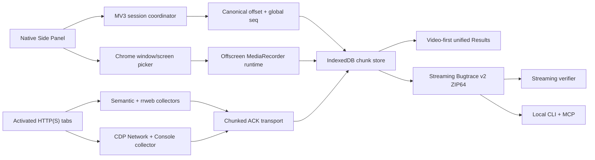

# Bugtrace 内部全保真录制实施计划

Status: Ready for approval
Created: 2026-08-18
Approval: Awaiting execution authorization
Scope: `extensions/bugtrace-recorder`、Bugtrace v2 制品、本地 Agent CLI/MCP

## Summary

将 Bugtrace 建成面向内部测试人员的单一全保真录制工具。产品使用 Jam 式窗口视频、统一时间轴、DevTools 轨道和低摩擦审阅体验，同时保留 Bugtrace 的逐事件语义记录、rrweb DOM 证据、本地制品、哈希校验、coverage/gap 和 Agent 查询契约。录制自动覆盖用户切换到的受支持 Tab；产品不提供 Current Tab 轻量模式、隐私模式、脱敏、录制时长限制、证据数量限制、请求体限制、制品体积限制、自动降质或自动上传。

## Clarifying Questions

- None。以下要求已经锁定：
  - 录制入口只有“窗口/屏幕全量录制”和“持续回溯”。
  - 不提供 Current Tab 轻量录制。
  - 所有技术上可获得的内容按原值采集，包括密码按键、Token、Cookie、Header 和请求/响应体。
  - 不设置产品级时长、数量、字节、分辨率、帧率或制品上限。
  - 不脱敏、不遮罩、不生成 Sanitized 副本。
  - 数据默认保存在本地，不自动上传。
  - 物理磁盘耗尽、浏览器不暴露数据、媒体源结束和真实写入失败必须精确报告。

## Fixed Product Contract

### Recording UX

- Side Panel 主按钮为“开始窗口录制”。
- 用户点击主按钮后，Chrome 原生选择器只提供 `window`、`screen` 和可用音频源，不提供 tab-only 产品入口。
- 录制期间自动接管用户激活的所有 HTTP(S) Tab，包括录制前已存在的 Tab、页面打开的后代 Tab、`Ctrl/Cmd + T` 后导航到 HTTP(S) 的 Tab，以及跨窗口激活的 Tab。
- Chrome 内部页、其他扩展页和 OS 原生界面保留窗口视频，页面级证据状态为 `visual_only`。
- Pause、Resume、Stop & Review、Bookmark、Screenshot 在 Side Panel 内始终可用。
- Side Panel 不显示 15 分钟提示、剩余可录分钟数、隐私模式或质量模式。

### Evidence Contract

- 窗口/屏幕视频是主视觉证据。
- 每次 click、pointer、keydown、input/change、submit、scroll、drag/drop 都保存为独立 occurrence。
- 每个 keydown 在回放对应时刻创建独立 toast；toast 不覆盖、不聚合、不互斥。
- Chrome DevTools Protocol、`webRequest` 和页面主世界 hook 共同采集 Network、Console、错误和运行时上下文。
- rrweb 保存 DOM 快照与 mutation，作为 DOM inspector 和视频不可用时的辅助回放。
- 同一 session 的视频、语义事件、rrweb、Network、Console、错误、截图和 gap 使用统一 `offsetMs` 与全局 `seq`。
- 所有原始页面内容标记为 `untrusted_observation`；Agent 不把页面文本当作指令。

### Unlimited Internal Contract

- 删除录制时长阈值和 `long_recording` 协议状态。
- 删除 semantic、rrweb、Console、Network、screenshot、transport、resource、entry、archive 和 Markdown 的产品级数量/字节截断。
- 固定大小只用于 transport framing 和持久化 chunk；超出 frame 大小时必须继续分块，不得丢弃或截断原始证据。
- UI 使用虚拟列表、分页、按需加载和 CSS 裁切保持性能；底层证据保持完整。
- 使用 `unlimitedStorage`、持久化存储请求、分块 IndexedDB 和流式 ZIP64 导出。
- 不运行基于敏感字段、Header、URL、输入、截图或正文内容的过滤器。
- 不自动清理 session，不设置 TTL；删除只由用户明确执行。
- 真实写入失败时记录精确 failure boundary，停止宣称后续 coverage 完整，并允许导出此前已确认写入的所有证据。

## Target Architecture



### Runtime Ownership

- Service Worker owns session state, Tab scope, producer admission, canonical sequence allocation and recovery metadata.
- Offscreen document owns `MediaStream`、`MediaRecorder`、media write queue and track lifecycle. Service Worker restart does not stop the stream.
- Content scripts own semantic and rrweb producers for one `{tabId, frameId, documentId, clientId}` identity.
- CDP collector owns debugger attachment, Network/Runtime/Log events and raw response-body retrieval for each scoped Tab.
- IndexedDB owns committed chunks; UI memory never owns the only copy of evidence.

### Media Pipeline

- `wxt.config.ts` declares `desktopCapture`、`offscreen`、`unlimitedStorage`、`debugger` and required Tab permissions.
- Side Panel calls `chrome.desktopCapture.chooseDesktopMedia(['window', 'screen', 'audio'])` from the start-button gesture.
- Offscreen document consumes the one-time stream ID immediately, creates `MediaRecorder`, writes each `dataavailable` chunk directly to IndexedDB, and only sends committed metadata to the Service Worker.
- MIME negotiation order is `video/webm;codecs=vp9,opus`、`video/webm;codecs=vp8,opus`、browser WebM default. Recorder bitrate caps are not set.
- Audio is requested only when `canRequestAudioTrack` is true.
- `track.onended` creates `visual_source_ended`; structure capture continues and Side Panel exposes “重新选择窗口”。

### Storage Model

IndexedDB schema version 2 adds these stores:

```text
sessions        session state, clock, scope, committed counters
events          ordered lightweight records and chunk references
chunks          media/body/rrweb/console payload chunks
assets          screenshots and small immutable resources
producers       client identity, ACK watermark, recovery metadata
```

Each chunk contains:

```ts
interface StoredChunk {
  id: string;
  sessionId: string;
  channel: 'media' | 'network-body' | 'rrweb' | 'console' | 'semantic' | 'asset';
  streamId: string;
  chunkIndex: number;
  startOffsetMs: number;
  endOffsetMs: number;
  mimeType: string;
  sha256: string;
  bytes: ArrayBuffer;
}
```

- `{sessionId, channel, streamId, chunkIndex}` is unique.
- A payload becomes visible only after all chunks and its commit record are durable.
- `append -> commit -> ACK` is the only accepted write order.
- Replayed client batches use `clientId + localSeq` idempotency.
- `expiresAt` and automatic cleanup are removed from v2 sessions.

### Bugtrace v2 Artifact

```text
session.bugtrace.zip
├── manifest.json
├── report.md
├── trace.json
├── schema/bugtrace-v2.schema.json
├── agent/overview.json
├── agent/reproduction.json
├── agent/anomalies.json
├── media/index.json
├── media/chunks/*.webm
├── rrweb/index.json
├── rrweb/chunks/*.json
├── network/index.json
├── network/bodies/*
├── screenshots/*
├── attachments/lifecycle.json
├── attachments/coverage.json
└── integrity/hashes.json
```

- `captureFidelity` is always `internal_full_fidelity`.
- v2 schema has no redacted evidence variant and no privacy summary.
- Large observations live in chunk resources; indexes contain evidence IDs、time ranges、source identities and hashes.
- `report.md` is an evidence index and reproduction report, not a truncated replacement for raw evidence.
- Results uses `showSaveFilePicker()` and a streaming ZIP64 writer; the archive is never assembled fully in memory.
- v1.1 artifacts remain readable through a read-only importer; all new sessions write v2.

### Agent Contract

- Agent reads `manifest.json -> agent/overview.json -> report.md -> coverage.json` before requesting raw evidence.
- Stable evidence URI format is `bugtrace://session/<sessionId>/<kind>/<evidenceId>`.
- CLI and MCP expose `listSessions`、`getSessionOverview`、`getReproductionSteps`、`getTimeline`、`getUserEvents`、`getConsoleLogs`、`getNetworkRequests`、`getNetworkBody`、`getScreenshot`、`getVideoChunks`、`getDomSnapshot`、`getCoverage` and `verifyArtifact`.
- Every response supports time range、Tab、frame、kind、severity and pagination filters.
- Every result includes evidence ID、time range、source identity and content hash.
- Large bytes are returned through file/resource handles, not embedded into the model context.

## File And Code References

### Existing Runtime

- `extensions/bugtrace-recorder/wxt.config.ts` — manifest permissions and MV3 entrypoint configuration.
- `extensions/bugtrace-recorder/entrypoints/background.ts` — Chrome lifecycle listeners and service dispatch.
- `extensions/bugtrace-recorder/src/background/recorder-service.ts` — session coordinator, Tab adoption, current admission caps, screenshot caps and current long-recording projection.
- `extensions/bugtrace-recorder/src/background/types.ts` — persisted session and raw diagnostic observations.
- `extensions/bugtrace-recorder/src/messaging/protocol.ts` — runtime protocol, current `long_recording` code and batch schema.
- `extensions/bugtrace-recorder/src/session/tab-scope.ts` — scope forest and top-level activated Tab membership.
- `extensions/bugtrace-recorder/entrypoints/recorder.content.ts` — content transport, producer lifecycle and current pending-byte caps.
- `extensions/bugtrace-recorder/entrypoints/diagnostics-main.content.ts` — fetch/XHR/WebSocket and Console bridge.
- `extensions/bugtrace-recorder/src/capture/semantic-recorder.ts` — raw occurrence capture.
- `extensions/bugtrace-recorder/src/capture/rrweb-segment.ts` — rrweb ownership and full-fidelity event clone.

### Existing Storage, Artifact And UI

- `extensions/bugtrace-recorder/src/storage/database.ts` — IndexedDB v1 stores, session expiration and event/asset persistence.
- `extensions/bugtrace-recorder/src/artifact/types.ts` — v1.1 privacy and evidence types.
- `extensions/bugtrace-recorder/src/artifact/bugtrace-v1.schema.json` — v1.1 schema.
- `extensions/bugtrace-recorder/src/artifact/bundle.ts` — JSZip in-memory build and current resource/archive caps.
- `extensions/bugtrace-recorder/src/artifact/markdown.ts` — current Markdown byte/observation truncation.
- `extensions/bugtrace-recorder/src/artifact/verifier.ts` — bundle integrity verification.
- `extensions/bugtrace-recorder/src/ui/trace-adapter.ts` — stored event to trace/replay projection and current redaction/truncation branches.
- `extensions/bugtrace-recorder/entrypoints/sidepanel/SidepanelApp.tsx` — recording controls, notices and long-recording UI.
- `extensions/bugtrace-recorder/entrypoints/results/ResultsApp.tsx` — review/export shell and current privacy panel.
- `extensions/bugtrace-recorder/src/ui/replay-panel.tsx` — replay selection and sandbox protocol.
- `extensions/bugtrace-recorder/src/ui/replay-sandbox.ts` — replay timeline and keyboard cue projection.
- `extensions/bugtrace-recorder/entrypoints/replay-sandbox/main.ts` — rrweb player, pointer and keyboard toast rendering.
- `extensions/bugtrace-recorder/entrypoints/replay-sandbox/style.css` — replay overlays and fitted-surface layout.

### New Modules

- `extensions/bugtrace-recorder/entrypoints/offscreen/index.html`
- `extensions/bugtrace-recorder/entrypoints/offscreen/main.ts`
- `extensions/bugtrace-recorder/src/media/types.ts`
- `extensions/bugtrace-recorder/src/media/offscreen-recorder.ts`
- `extensions/bugtrace-recorder/src/media/media-coordinator.ts`
- `extensions/bugtrace-recorder/src/capture/cdp-recorder.ts`
- `extensions/bugtrace-recorder/src/storage/chunk-store.ts`
- `extensions/bugtrace-recorder/src/artifact/bugtrace-v2.schema.json`
- `extensions/bugtrace-recorder/src/artifact/migrate-v1.ts`
- `packages/bugtrace-agent/package.json`
- `packages/bugtrace-agent/src/archive.ts`
- `packages/bugtrace-agent/src/cli.ts`
- `packages/bugtrace-agent/src/mcp.ts`

### Authoritative Platform References

- [Chrome screen capture](https://developer.chrome.com/docs/extensions/how-to/web-platform/screen-capture) — offscreen document retains display capture across page navigation.
- [Chrome offscreen API](https://developer.chrome.com/docs/extensions/reference/api/offscreen) — MV3 DOM/media runtime and `DISPLAY_MEDIA` lifecycle.
- [Chrome desktopCapture API](https://developer.chrome.com/docs/extensions/reference/api/desktopCapture) — user-gesture source picker and one-time stream ID.
- [Chrome debugger API](https://developer.chrome.com/docs/extensions/reference/api/debugger) — CDP Network、Runtime、Log and response-body access.
- [Chrome permissions](https://developer.chrome.com/docs/extensions/reference/permissions-list) — `unlimitedStorage` coverage for IndexedDB and extension storage.

## Task Dispatch

### Execution Waves

| Wave | Parallel lanes | Exit condition |
| --- | --- | --- |
| W0 | Contract + Storage + Scope + QA fixtures | No long-recording state; no automatic expiry; active Tab adoption is deterministic |
| W1 | Raw capture + CDP + Chunk transport + Media runtime | All evidence channels persist through chunk commit/ACK; window video survives Service Worker restart |
| W2 | Results UX + v2 artifact + streaming export | One continuous video-first review; raw ZIP64 verifies without full-memory assembly |
| W3 | CLI/MCP + continuous recall + endurance QA | Agent queries are evidence-addressable; long-run matrix passes without product caps |

### Ownership Lanes

- Runtime lane: protocol、session coordinator、scope、recovery and notices.
- Capture lane: semantic、rrweb、main-world diagnostics、CDP and transport.
- Media/storage lane: offscreen recorder、chunk store、persistence and streaming export.
- UX lane: Side Panel、Results、timeline、keyboard/pointer overlays and i18n.
- Artifact/Agent lane: v2 schema、verifier、CLI、MCP and provenance.
- QA lane: unit、integration、Playwright production MV3 and endurance harness.

## Plan Todos

### W0 — Contract, Scope And Durable Storage

- [ ] **W0-R1 — Remove duration warning contract** — Runtime lane — no dependency.
  - Update `src/messaging/protocol.ts` to remove `LONG_RECORDING_WARNING_THRESHOLD_MS`、`long_recording` and `shouldShowLongRecordingWarning`.
  - Replace warnings with typed notices: `runtime_interrupted`、`capture_gaps`、`visual_source_ended`、`visual_only_tab`、`storage_write_failed`、`storage_exhausted`、`debugger_detached`.
  - Update `src/background/recorder-service.ts` and `entrypoints/sidepanel/SidepanelApp.tsx`; remove duration-based projection and UI.
  - Remove long-recording catalog keys and replace affected tests.
  - Gate: 14 秒、有 gap 的短会话和 2 小时健康会话均不存在时长 notice。

- [ ] **W0-R2 — Lock dynamic multi-Tab scope** — Runtime lane — no dependency.
  - Route `tabs.onCreated`、`tabs.onActivated`、`tabs.onUpdated`、`tabs.onReplaced`、`tabs.onDetached/Attached` and `webNavigation.onCreatedNavigationTarget` through one per-Tab serialized lifecycle queue.
  - Add independent activated HTTP(S) Tab as top-level scope member with `parentTabId: null`.
  - Treat `chrome://newtab -> HTTP(S)` as one transition without a false gap.
  - Require HELLO/versioned readiness before classifying delivery failure.
  - Gate: existing Tab、descendant Tab、new Tab、cross-window Tab and return-to-Tab paths all record into one session with zero false gaps.

- [ ] **W0-S1 — Upgrade persistent storage to v2** — Media/storage lane — no dependency.
  - Add `unlimitedStorage` permission and call `navigator.storage.persist()` from a trusted extension page.
  - Upgrade `src/storage/database.ts` to stores `sessions/events/chunks/assets/producers`.
  - Add `src/storage/chunk-store.ts` with transactional append/commit/read/stream/delete APIs.
  - Remove `expiresAt`、`by-expires-at` and automatic cleanup from v2 sessions.
  - Add a v1-to-v2 IndexedDB migration that preserves existing sessions.
  - Gate: browser restart and Service Worker termination preserve committed records and chunks; only explicit discard deletes data.

- [ ] **W0-Q1 — Establish full-fidelity fixtures** — QA lane — no dependency.
  - Extend `tests/fixtures/sensitive.html` with password、Token、Cookie/Header、large body、large Console、iframe、Canvas and repeated-key scenarios.
  - Add deterministic fixture endpoints for large request/response streaming and cross-origin iframe traffic.
  - Store expected marker hashes so tests assert original values, not only presence.
  - Gate: fixtures cover every raw evidence class before capture changes land.

### W1 — Unlimited Raw Capture And Window Media

- [ ] **W1-C1 — Replace admission caps with lossless framing** — Capture lane — depends on W0-S1.
  - Remove semantic、rrweb、Console、Network、screenshot and pending-transport product caps from `recorder-service.ts` and `recorder.content.ts`.
  - Implement chunk envelopes: `streamId`、`chunkIndex`、`final`、`sha256`、`clientId`、`localSeq`、`sessionRevision`.
  - Persist every frame before ACK; reconnect from the last committed watermark.
  - Split oversized events and bodies without truncating them.
  - Gate: payloads larger than one runtime message round-trip byte-identically and deduplicate after forced retry.

- [ ] **W1-C2 — Remove capture-time privacy transforms** — Capture lane — depends on W0-Q1 and W1-C1.
  - Record exact key and input values in `semantic-recorder.ts`, including password fields.
  - Preserve full target text、locator paths、URLs、headers and diagnostics payloads.
  - Remove privacy filters from capture and adapter paths; retain escaping utilities used solely for safe rendering.
  - Move `src/privacy/escape.ts` 的 escaping/untrusted quoting helpers to `src/security/untrusted.ts`.
  - Remove unused privacy input、Header allowlist、URL redaction、payment-card、secret-scan and sensitive-field modules after imports migrate.
  - Rename legacy sanitizer compatibility symbols or remove them after all imports migrate.
  - Gate: original fixture values and hashes survive capture、storage、Results projection and artifact export.

- [ ] **W1-C3 — Add CDP diagnostics collector** — Capture lane — depends on W0-R2 and W0-S1.
  - Add `debugger` permission and `src/capture/cdp-recorder.ts`.
  - Attach to each scoped HTTP(S) Tab; enable Network、Runtime and Log domains.
  - Store request/response headers、cookies、status、timing、initiator、WebSocket frames、Console calls、exceptions and every response body Chrome returns.
  - Correlate CDP、`webRequest` and main-world events by request ID/fingerprint without deleting any source record.
  - Record `debugger_detached` with exact range and reason; reattach when the Tab becomes available.
  - Gate: failed request、redirect、XHR/fetch、static asset、WebSocket、Console error and unhandled rejection are time-aligned and source-attributed.

- [ ] **W1-M1 — Implement offscreen window recorder** — Media/storage lane — depends on W0-S1.
  - Add offscreen entrypoint and media modules.
  - Create the offscreen document before opening the desktop picker.
  - Consume the stream ID immediately, negotiate WebM MIME, start `MediaRecorder`, and write chunks directly to IndexedDB.
  - Persist track settings、chunk offsets、duration、MIME、audio availability and hashes.
  - Implement pause/resume/stop/track-ended and idempotent command ACKs.
  - Gate: video covers Tab switching、address bar、popup、Canvas、iframe and browser chrome; Service Worker termination does not stop media capture.

- [ ] **W1-M2 — Integrate media/session recovery** — Runtime + Media/storage lanes — depends on W1-M1.
  - Reconcile Service Worker state with the offscreen recorder at initialization.
  - Mark orphaned or interrupted streams without discarding committed chunks.
  - On track end, keep structural collection active and expose a one-click source reselection path.
  - Use canonical session offsets for media start/end and chunk ranges.
  - Gate: pause/resume、source reselect、worker restart、Side Panel close/reopen and browser crash recovery produce one continuous session timeline.

### W2 — Video-First Results And Raw Artifact v2

- [ ] **W2-U1 — Replace segment-first Results with unified timeline** — UX lane — depends on W1-M2 and W1-C3.
  - Make window video the default player; stream chunks through `MediaSource` without concatenating the whole recording in memory.
  - Render tracks for active Tab、actions、keys、pointer、Console、Network、errors、bookmarks and coverage.
  - Hide rrweb producer segments from primary navigation; expose rrweb through “检查 DOM”。
  - Seek from any marker to the same canonical video/DOM time.
  - Gate: a cross-Tab session appears as one recording and every marker resolves to matching visual and structured evidence.

- [ ] **W2-U2 — Complete keyboard and pointer overlays** — UX lane — depends on W2-U1.
  - Project every keydown to one `.replay-keyboard-toast` node keyed by occurrence index.
  - Use replay time for creation and independent expiry; pause freezes, seek recomputes, restart clears and replays.
  - Stack new toasts upward from the fitted video/DOM surface bottom-right; use wrapping columns when the active toast set exceeds surface height.
  - Keep exact raw key labels for password、repeat、modifier、Dead and Process events.
  - Preserve pointer/click events and show derived click ripples only when enabled.
  - Gate: no occurrence is overwritten, grouped or lost during rapid typing、same-key repeat、seek、pause、restart、resize or fullscreen.

- [ ] **W2-U3 — Finalize internal-recorder UX** — UX lane — depends on W0-R1 and W1-M2.
  - Remove Current Tab、privacy preset、privacy review、quality selector and sanitized-export UI.
  - Present one primary “开始窗口录制” flow and one “持续回溯” entry.
  - Display timer、active Tab、scoped Tab count、event count、persisted bytes and Visual/Actions/Diagnostics health.
  - Display only actionable runtime/media/storage/gap notices.
  - Gate: start requires one product click plus one Chrome picker confirmation; switching Tab never requires reopening controls.

- [ ] **W2-A1 — Define and emit Bugtrace v2** — Artifact/Agent lane — depends on W1-C2、W1-C3 and W1-M2.
  - Add v2 types/schema for media chunks、raw bodies、full-fidelity capture、layered coverage and evidence URIs.
  - Remove privacy mode、redaction count、redacted input and truncated observation variants from v2.
  - Preserve unbounded raw values in chunk resources; indexes contain references and hashes.
  - Add `migrate-v1.ts` for read-only v1.1 import.
  - Generate `agent/overview.json`、`reproduction.json` and `anomalies.json` from evidence IDs.
  - Gate: schema、semantic consistency and resource closure pass for complete、partial、visual-only and interrupted sessions.

- [ ] **W2-A2 — Replace in-memory capped ZIP with streaming ZIP64** — Media/storage + Artifact/Agent lanes — depends on W2-A1.
  - Replace JSZip build limits with `@zip.js/zip.js` streaming ZIP64 output.
  - Stream IndexedDB chunks to a `showSaveFilePicker()` writable from the Results user gesture.
  - Calculate entry SHA-256 while streaming; write `integrity/hashes.json` and final manifest after entry metadata is known.
  - Convert browser verifier and Node verifier to incremental readers.
  - Remove absolute resource-count、entry-size、archive-size and decompressed-total caps; retain structural validation、hash validation、backpressure and user cancellation.
  - Gate: artifacts larger than current entry/aggregate/archive caps export and verify without full-archive memory allocation.

- [ ] **W2-A3 — Remove report and adapter truncation** — Artifact/Agent + UX lanes — depends on W2-A1.
  - Remove content truncation and redaction branches from `trace-adapter.ts` and `markdown.ts`.
  - Keep Results performant through virtualized rows and on-demand evidence expansion.
  - Make `report.md` a complete index of steps/anomalies with evidence URIs; store large content in referenced resources.
  - Gate: UI remains responsive for large sessions while copy/download/export can retrieve every original value.

### W3 — Agent Surface, Continuous Recall And Production Qualification

- [ ] **W3-G1 — Add streaming CLI** — Artifact/Agent lane — depends on W2-A2.
  - Add `packages/*` to `pnpm-workspace.yaml` and create `packages/bugtrace-agent`.
  - Implement `bugtrace verify`、`overview`、`timeline`、`events`、`console`、`network`、`body`、`screenshot`、`video-chunks`、`dom` and `coverage`.
  - Return compact JSON by default and stream large evidence to a requested output file.
  - Gate: CLI processes the endurance artifact without loading the full archive or full trace into memory.

- [ ] **W3-G2 — Add read-only MCP server** — Artifact/Agent lane — depends on W3-G1.
  - Expose the Agent Contract tools over stdio MCP.
  - Enforce read-only session access and evidence URI provenance.
  - Treat all recorded content as untrusted data and keep it outside tool instructions.
  - Add pagination、time-range and source filters to every list operation.
  - Gate: an Agent obtains reproduction steps、key errors、failed requests、matching video chunks and coverage in bounded queries.

- [ ] **W3-I1 — Implement unlimited continuous recall** — Runtime + Capture + Media/storage lanes — depends on W1-C1 and W0-S1.
  - Start DOM、semantic、Console and Network capture when continuous recall is enabled.
  - Persist from enable time forward; do not use a 120-second ring buffer or automatic expiry.
  - Preserve complete history until the user saves or deletes it.
  - Do not claim pre-authorized window video; visual evidence before display-media authorization is rrweb DOM only.
  - Gate: saving recall produces a valid v2 artifact covering the complete enabled interval.

- [ ] **W3-Q1 — Run production and endurance qualification** — QA lane — depends on all W0-W3 implementation tasks.
  - Run unit、integration、production MV3 Playwright and real Chrome native Side Panel/media-picker matrices.
  - Run 30-minute and 2-hour sessions as endurance checkpoints, not product limits.
  - Include rapid keys、large bodies、large Console、cross-window Tabs、worker termination、track end、browser restart and disk-write failure.
  - Capture heap、write latency、chunk backlog、dropped occurrence count and hash verification results.
  - Gate: zero product-triggered stop、zero silent truncation、zero automatic redaction、zero false long-recording notice and zero unexplained evidence loss.

## Build From Plan

- Ready to build: Yes after explicit approval.
- Selected todos: All W0-W3 tasks unless approval names a subset.
- Execution order: W0 gates first; W1 capture/media lanes run in parallel; W2 starts after committed media/raw contracts; W3 starts after v2 export is stable.
- Integration owner merges protocol/schema changes before dependent lanes rebase their work.
- Each task receives its listed files, dependency commits, fixture IDs and exit gate.
- Implementation preserves unrelated working-tree changes and does not rewrite completed user work outside the assigned task.
- Every completed task updates this checklist and records validation output in its handoff.

## Validation

### Static And Unit

```bash
pnpm --filter @juner/bugtrace-recorder typecheck
pnpm --filter @juner/bugtrace-recorder lint
pnpm --filter @juner/bugtrace-recorder test
pnpm --filter @juner/bugtrace-agent typecheck
pnpm --filter @juner/bugtrace-agent test
```

### Production Build And Browser E2E

```bash
pnpm --filter @juner/bugtrace-recorder build
pnpm --filter @juner/bugtrace-recorder exec playwright test --workers=1
```

Required production specs:

- `tests/e2e/multitab-recording.spec.ts` — existing、descendant、newtab-to-HTTP、cross-window and return paths.
- `tests/e2e/media-recording.spec.ts` — picker、offscreen lifetime、pause/resume、track end and video/clock alignment.
- `tests/e2e/full-fidelity.spec.ts` — password、Token、Cookie、Header、body、Console and screenshot raw-value hashes.
- `tests/e2e/replay-sandbox.spec.ts` — independent keyboard toasts、pointer、seek、pause、restart、letterbox and fullscreen.
- `tests/e2e/results.spec.ts` — one timeline、video-first playback、DOM inspector and no producer-segment navigation.
- `tests/e2e/artifact-v2.spec.ts` — schema、hash、resource closure、streaming export and v1.1 import.
- `tests/e2e/recovery.spec.ts` — Service Worker、offscreen、browser restart and committed-chunk recovery.

### Endurance And Failure Injection

- Generate deterministic 30-minute and 2-hour sessions with continuous media、rrweb、keys、Console and bodies.
- Terminate the Service Worker during active recording and verify media plus capture recovery.
- Force duplicate/reordered transport frames and verify idempotent commit.
- Force IndexedDB write rejection and verify exact failure boundary plus successful partial export.
- Verify no `long_recording` string/code/catalog entry remains in production sources.
- Verify no Raw artifact value matches a transformed/redacted substitute when the fixture original is available.
- Verify recorded event count equals emitted fixture occurrence count for every channel.
- Verify peak memory follows active working-set size rather than total recording size.

## Risks

| Risk | Required control | Release gate |
| --- | --- | --- |
| Physical disk exhaustion | `unlimitedStorage`、persistent storage、streamed chunks、explicit failure boundary | All committed evidence remains verifiable and exportable |
| CDP detached by DevTools or another debugger | typed `debugger_detached` notice、coverage range、reattach path | No diagnostic layer is reported complete during detach |
| Media stream ends or offscreen context dies | direct chunk commits、track notice、source reselection、session recovery | Structured capture continues and prior video remains playable |
| High-rate evidence overwhelms UI | virtual lists、pagination、on-demand body/DOM loading | No source evidence is dropped or truncated |
| Large export exhausts memory | streaming ZIP64 and incremental hashes | Memory does not scale with total archive size |
| Duplicate producers create rrweb fragments | document-owner lease and producer identity admission | One active rrweb producer per document lifecycle |
| Video and structured clocks drift | canonical offset、clock-pair calibration、alignment tests | Marker-to-video error stays inside the measured test tolerance |
| Raw secrets leave the machine | no automatic upload、local-only UI label、explicit user-controlled file export | Network test confirms zero artifact upload requests |
| Recorded page attempts prompt injection | untrusted observation type、escaped rendering、MCP instruction separation | Adversarial fixture cannot change tool behavior |

## Grill-Me Outcome

- Status: Skipped.
- Reason: Product scope、privacy posture、recording scope、retention and limit behavior are locked requirements; this revision only converts the approved direction into executable task dispatch.

## Approval

- Status: Awaiting execution authorization.
- Approval target: All W0-W3 tasks or an explicitly selected task subset.
- Implementation starts only after approval and follows the dependency order in this file.
